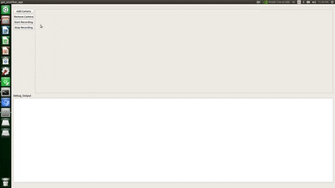

# Argus_Open

The Argus Open strives to be an open source security platform based off of GStreamer and Qt. The hope is to integrate any camera into the system, providing the user with utmost flexibility when creating a security implementation for the home. Currently tested with ADT Sercomm Camera, and USB cameras for streaming data to GUI, and to mp4 files. 

## Supported Platforms

All code based has only been tested on Linux 18.04, running on an ARM core (Xavier NX Development Board). After polishing of app/meeting milestones, other systems will be tested.

## Getting started

Code is based off of Gstreamer 1.14, and Qt 5.9.5, all other releases are untested. 

To install Qt tools, follow the instructions:

```
Add later
```

To install Gstreamer 1.14

```
Add later
```

## How to use

Right now app is MVP. Can add RTSP cameras (currently no error checking for bad inputs), and select cameras using GstDeviceMonitor. All settings are saved to xml file. 

Example of app working:



## Goals

- Error proof the camera selection/add error messages to unsuccessful camera links
- Create custom Gstreamer filesink to write a new file after n amount of time in minutes
- Attempt reconnection if camera link is lost for RTSP
- Probe IP addr on local network for RTSP and provide dropdown menu
- Make GUI not terrible
- Create SRTSP server to allow cellphone app to receive live streams
- Create custom media player to allow for access of saved files
- insert Deepstream SDK for recognition of moving vehicles, people, facial recognition/tracking/web scrape, license plate recognition

